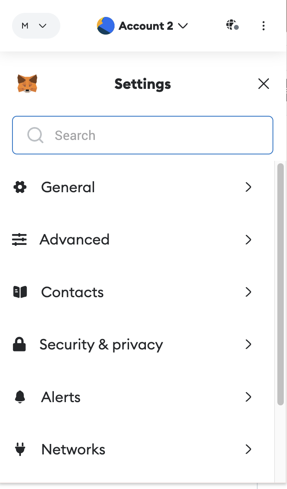
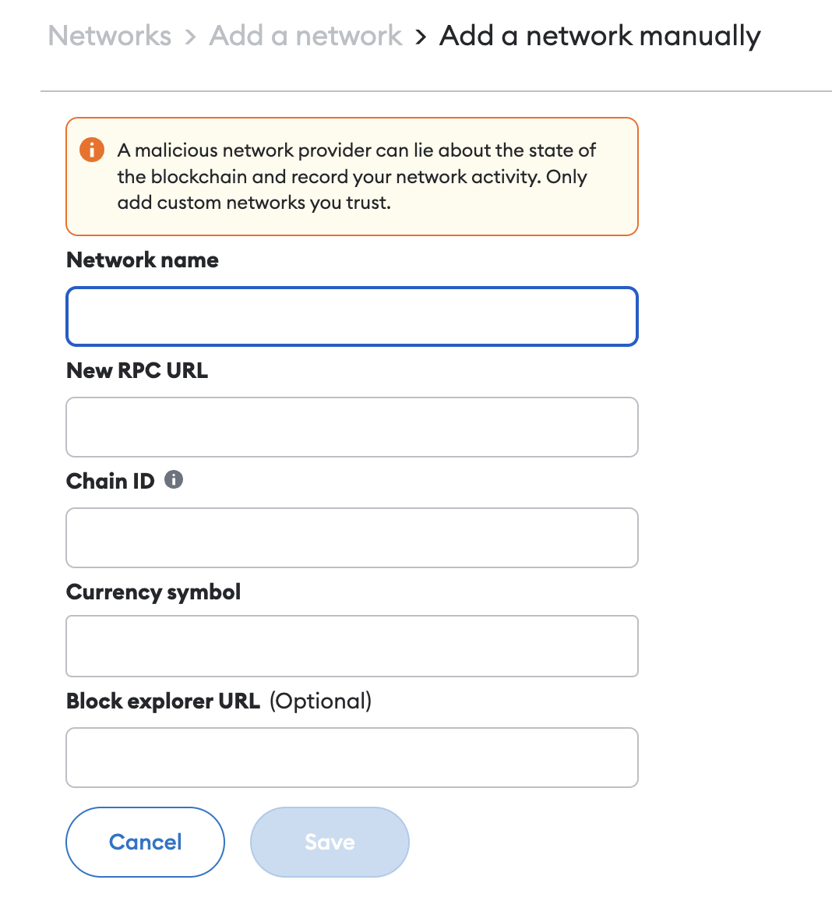
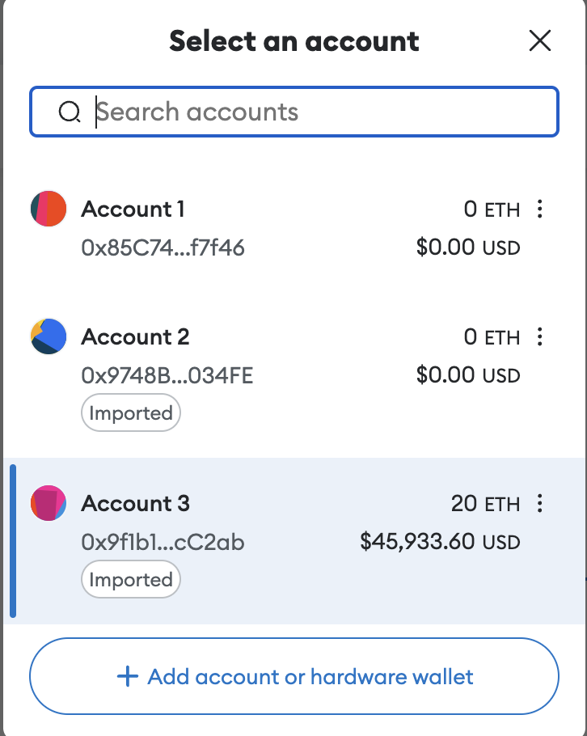
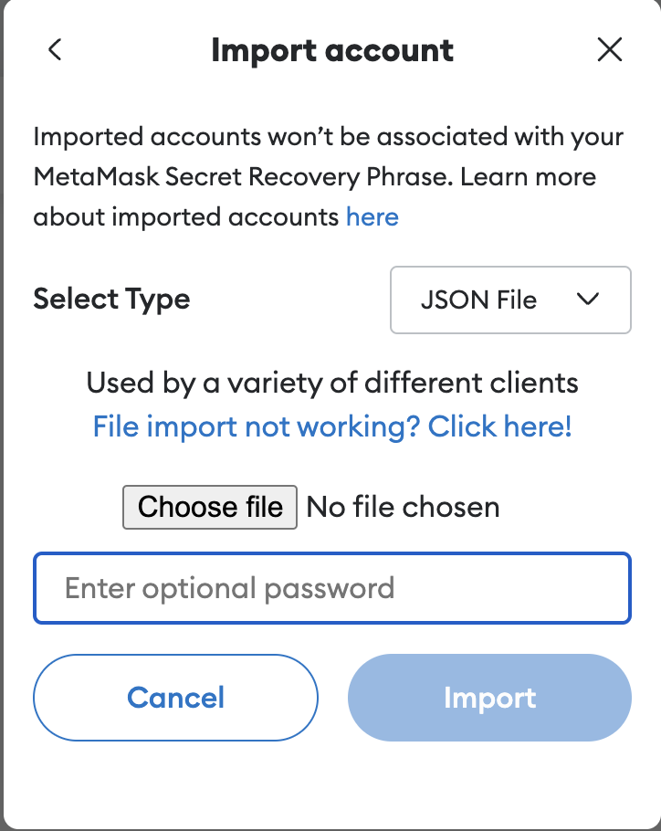
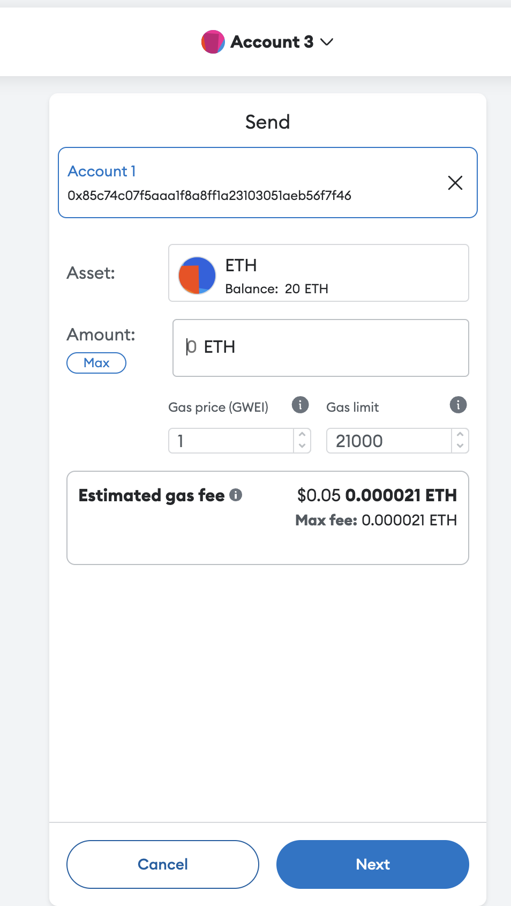

# My Private Chain

## Get started

### Clone the repo and then run init.sh

```
./init.sh
```

### Run the private chain

```
docker compose up
```

## Verify

```
curl http://127.0.0.1:8545 -X POST -H 'Content-Type: application/json' --data '{"jsonrpc":"2.0","method":"web3_clientVersion","params":[],"id":67}'
```

An exmaple output:

```json
{
  "jsonrpc": "2.0",
  "id": 67,
  "result": "Geth/v1.13.11-stable-8f7eb9cc/linux-arm64/go1.21.6"
}
```

## Connect with MetaMask

1. Install MetaMask and go to `Settings`



2. Navigate to the page to add network via **Settings**>**Networks**>**Add a network**>**Add a network manually**.



3. Add the account created to MetaMask

Go to **Select Acount**



Go to import account page via **Add account or hardware wallet**>**import account**



4. After you imoprt the account in genesis.json then you can transfer ETH to any account.


